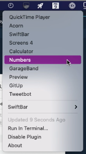

# xbar-recent-apps

A plugin for [xbar/BitBar](https://xbarapp.com/) / [SwiftBar](https://swiftbar.app/) to show the ten most recently used apps that aren't permanently in the Dock. The Dock only shows the latest three non-running apps, but I wanted more! Selecting an entry will launch the app. The default hotkey is `Cmd-Option-A`. 

